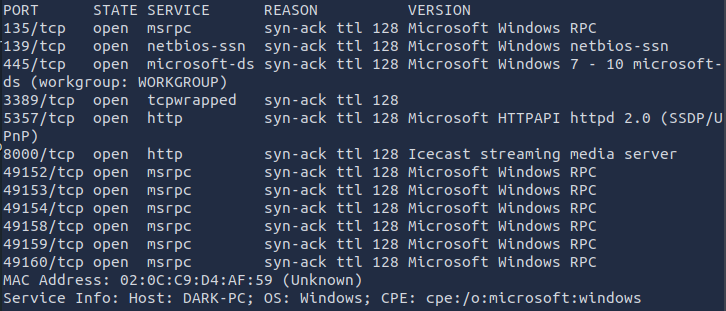
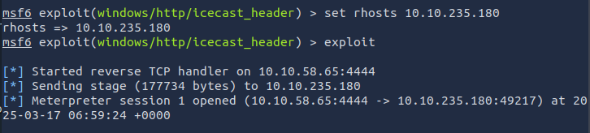
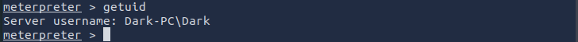
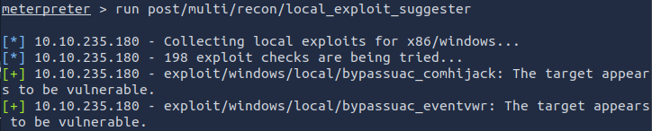
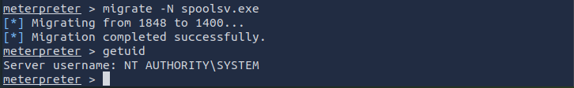
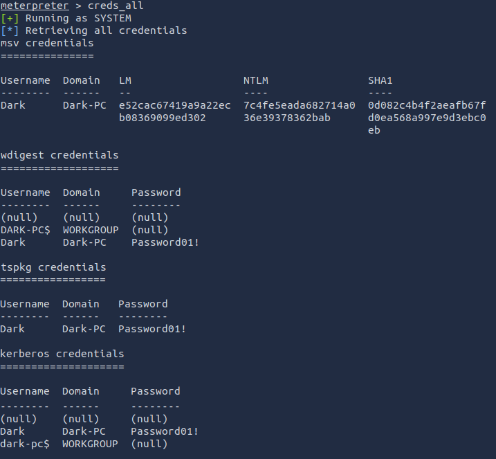
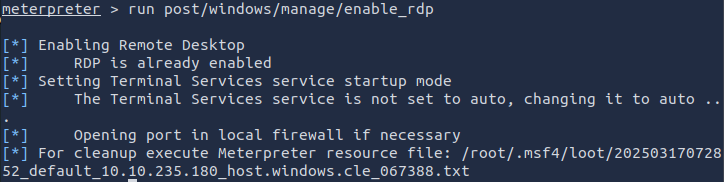

# ❄️ ICE Room - TryHackMe Walkthrough 🚀

## 🔍 Overview
The **ICE Room** on TryHackMe is a Windows-based security challenge that demonstrates:
- **Network enumeration & exploitation**
- **Windows privilege escalation**
- **Post-exploitation techniques (Mimikatz, RDP persistence)**

---

## 🎯 1. Enumeration (Scanning for Open Ports)
### 🔹 Nmap Scan
We start by scanning for open ports using Nmap.

✅ Discovered Open Ports:
- 3389 → RDP
- 8000 → Icecast HTTP service
- 445 → SMB (not used in ICE Room)
- 5357 → HTTPAPI

---

## 🔥 2. Exploitation (Gaining Initial Access)

### 🔹 Icecast Buffer Overflow Exploit
We use Metasploit to exploit Icecast’s header overwrite vulnerability.

✅ Gained a Meterpreter session! 🎉

---

## 🔼 3. Privilege Escalation

### 🔹 Checking Privileges
✅ Initial access as: Dark-PC\Dark  
✅ OS: Windows 7 SP1  

### 🔹 Running Exploit Suggester
✅ Vulnerabilities found:
- bypassuac_eventvwr (Used for escalation)
- ms15_051_client_copy_image (Another privesc option)

### 🔹 Privilege Escalation to SYSTEM
✅ Successfully escalated to NT AUTHORITY\SYSTEM.

---

## 🏆 4. Post-Exploitation (Credential Dumping & Persistence)

### 🔹 Dumping Credentials with Mimikatz
✅ Extracted plaintext credentials:
- **Username**: Dark
- **Password**: Password01!

### 🔹 Enabling RDP for Persistence
✅ RDP enabled.

---

## 🔑 Key Takeaways
- **Exploiting Icecast's buffer overflow** allows easy initial access.
- **Privilege escalation via UAC bypass gives** SYSTEM privileges.
- **Credential dumping (Mimikatz)** can reveal plaintext passwords.
- **Enabling RDP ensures persistence** for later access.

---

